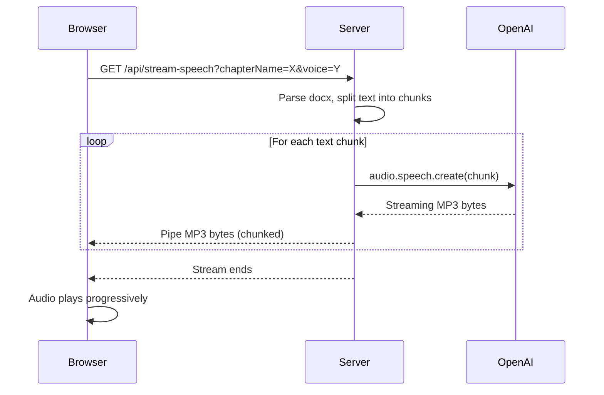

# Stream TTS Playback

## How it works

The OpenAI TTS API already supports chunked transfer encoding -- audio bytes start arriving before the full file is generated. Instead of buffering everything on the server and saving to disk, we pipe each chunk's stream straight to the HTTP response. The browser's `<audio>` element handles progressive MP3 download natively, so playback begins almost immediately.




## Server changes ([server.js](server.js))

Add a new **GET** endpoint `GET /api/stream-speech`:

- Query params: `chapterName` (optional), `message` (optional fallback), `voice`, `model`, `speed`
- Validate inputs, return JSON errors (with proper `Content-Type: application/json`) before starting the audio stream so the client can distinguish error responses from audio
- Set `Content-Type: audio/mpeg` and begin streaming
- For each text chunk, call `openai.audio.speech.create()` and pipe the response body to Express using `Readable.fromWeb()`:

```javascript
import { Readable } from "stream";

const speech = await openai.audio.speech.create({
  model, voice, input: chunk, response_format: "mp3", speed,
});
const nodeStream = Readable.fromWeb(speech.body);
await new Promise((resolve, reject) => {
  nodeStream.pipe(res, { end: false });
  nodeStream.on("end", resolve);
  nodeStream.on("error", reject);
});
```

- After all chunks, call `res.end()`
- Wrap in try/catch: if an error occurs mid-stream, just `res.end()` (can't send JSON at that point)

## Client changes ([public/script.js](public/script.js))

Add a `previewAudio(url)` function:

- Create `new Audio(url)` and call `.play()`
- Wire up `onerror` to show a status message
- Wire up `ended` to reset UI state
- Track the active preview so clicking again stops the current one

Add an `onPreview()` handler for a new "Preview" button:

- Builds the streaming URL: `/api/stream-speech?chapterName=...&voice=...&model=...`
- Calls `previewAudio(url)`
- Updates button text to "Stop Preview" while playing

Add an `onTestPreview()` handler (or reuse the same button) for test messages.

## HTML changes ([public/index.html](public/index.html))

- Add a "Preview" button next to the existing "Generate Audio" button in the button row
- Add a "Preview Test" button next to the existing "Generate Test" button (or a single "Preview Test" button)

## No changes needed to

- Manifest, audio saving, delete, or existing generate endpoints -- those stay as-is for the "save to disk" flow

